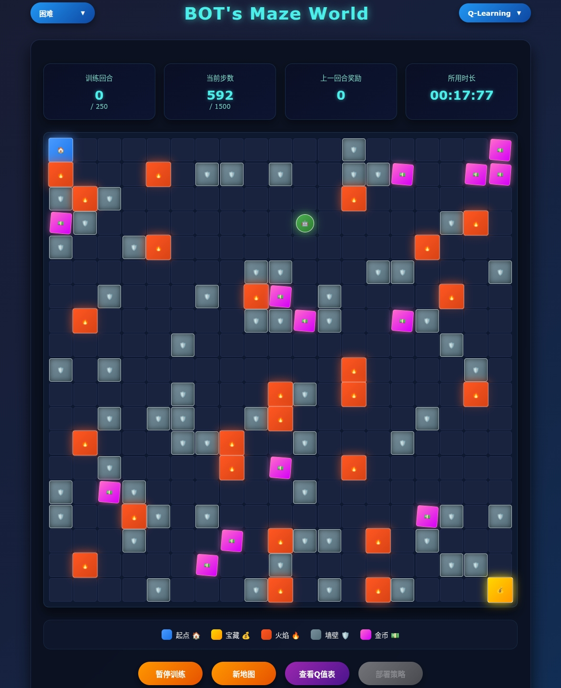

# 🎮 强化学习入门项目集

欢迎来到强化学习世界！这个项目列表包含了多个有趣的HTML演示，帮助你直观地理解强化学习的核心概念。

## 🎯 **学习目标**

通过这些交互式的HTML演示，你将能够：
- 理解强化学习的基本概念
- 观察算法的实时学习过程
- 体验不同策略的效果差异
- 掌握核心算法的工作原理
- 让我们一起开启强化学习的奇妙之旅吧！ ✨

## 📚 项目概览

### 一、 **BOTs-Maze-World**
- **算法对比**: Q-Learning、SARSA、Expected SARSA三种方法的实现
- **多样化环境**: 三种不同大小的地图配置
- **丰富元素**: 包含障碍物、陷阱以及金币奖励机制
- **可视化学习**: 直观展示不同算法的学习过程和策略收敛

点击访问：
🔗 [🤖 BOTs-Maze-World ](BOTs-Maze-World.html)

